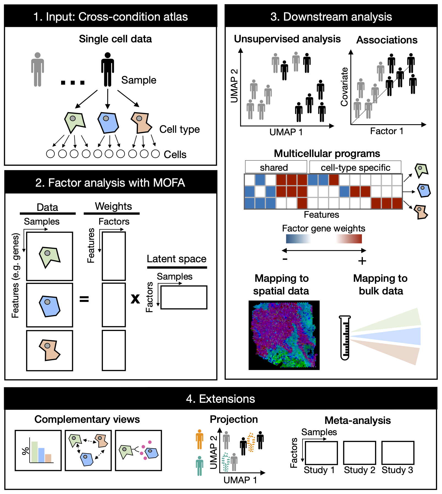

## Multicellular factor analysis for a tissue-centric understanding of disease

### Abstract

Cross-condition single-cell atlases are essential in the characterization of human disease. In these complex experimental designs, patient samples are profiled across distinct cell types and clinical conditions to describe disease processes at the cellular level. However, most of the current analysis tools are limited to pairwise cross-condition comparisons, disregarding the multicellular nature of disease processes and the effects of other biological and technical factors in the variation of gene expression. Here we propose a computational framework for an unsupervised analysis of samples from cross-condition single cell atlases and for the identification of multicellular programs associated with disease. Our framework based on probabilistic factor analysis implemented in [MOFA](https://www.embopress.org/doi/full/10.15252/msb.20178124) and [MOFA+](https://genomebiology.biomedcentral.com/articles/10.1186/s13059-020-02015-1) incorporates the variation of patient samples across cell types and allows the joint analysis of independent patient cohorts facilitating study integration. We applied our framework to a collection of acute and chronic human heart failure single-cell datasets and described multicellular processes of cardiac remodeling that were conserved in independent spatial and bulk transcriptomics datasets. We found that our framework can identify multicellular programs that are cell-state and cell-type-composition independent, providing a complementary tissue-centric understanding of disease that is usually ignored in classic analyses. In sum, our proposed analysis serves as an exploratory tool for the growing collection of cross-condition single-cell studies and allows for the integration of the measurements of patient cohorts across distinct data modalities, facilitating the generation of comprehensive tissue-centric descriptions of disease..

***

### How to implement
 
 All the necessary tools for modeling are already available in Bioconductor's [MOFA2](https://biofam.github.io/MOFA2/) package. 
 
 A complementary R package [MOFAcellulaR](https://github.com/saezlab/MOFAcellulaR) facilitates the usage of MOFA for the unsupervised analysis of samples and estimation of multicellular programs.
 
 A python implementation within our [LIANA](https://github.com/saezlab/liana-py) framework is available [here](https://liana-py.readthedocs.io/en/latest/notebooks/mofacellular.html)

### How to cite
 > Ramirez-Flores RO, Lanzer JD, Dimitrov D, Velten B, Saez-Rodriguez J. “Multicellular factor analysis for a tissue-centric understanding of disease” BioRxiv. 2023. DOI: [10.1101/2023.02.23.529642](https://www.biorxiv.org/content/10.1101/2023.02.23.529642v1)

### Availabilty of data

The datasets supporting the conclusions of this publication are available at Zenodo:
10.5281/zenodo.8082895

From Zenodo you can download these (zipped) folders: 

* `pub_data` - Contains the directory with processed data sets used for the analysis and to generate the figures

Please deposit the unzipped folders in the root directory of this R-project.

**Exceptions:**
  
Spatial data used in this publication is not shared in this Zenodo entry but rather we redirect to the original files that can be consulted [here](https://github.com/saezlab/visium_heart)

***

### Analyses & Scripts

#### Multicellular factor analysis applied to [human myocardial infarction](https://www.nature.com/articles/s41586-022-05060-x)
Script available [here](https://github.com/saezlab/MOFAcell/tree/main/MI)

#### Multicellular factor analysis applied to [end-stage human heart failure (Chaffin2022)](https://www.nature.com/articles/s41586-022-04817-8)
Script available [here](https://github.com/saezlab/MOFAcell/tree/main/DCM_HCM)

#### Multicellular factor analysis applied to [end-stage human heart failure (Reichart2022)](https://www.science.org/doi/10.1126/science.abo1984)
Script available [here](https://github.com/saezlab/MOFAcell/tree/main/DCM_Hubner)
 
#### Meta-analysis
Script available [here](https://github.com/saezlab/MOFAcell/tree/main/meta)

