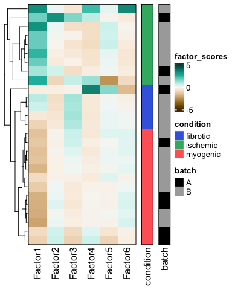
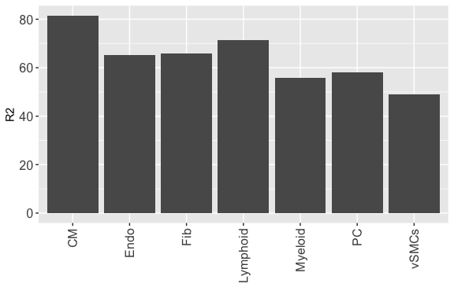
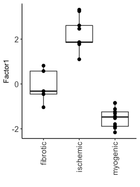
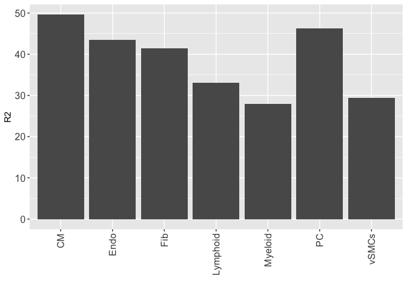
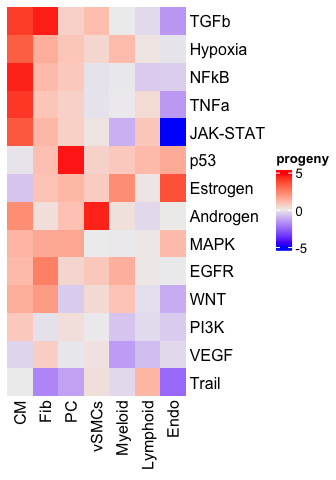

``` r
library(MOFA2)
library(HDF5Array)
library(ComplexHeatmap)
library(circlize)
library(tidyverse)
library(scater)
library(scran)
library(edgeR)
library(decoupleR)
reticulate::use_condaenv(condaenv = "/Users/ricardoramirez/opt/miniconda3/envs/MOFA")
```

## Multicellular factor analysis

We repurposed the statistical framework of multi-omics factor analysis
[(MOFA)](https://www.embopress.org/doi/full/10.15252/msb.20178124) and
[MOFA+](https://genomebiology.biomedcentral.com/articles/10.1186/s13059-020-02015-1)
to analyze cross-condition single cell atlases. These atlases profile
molecular readouts (eg. gene expression) of individual cells per sample
that can be classified into groups based on lineage (cell types) or
functions (cell states). We assumed that this nested design could be
represented as a multi-view dataset of a collection of patients, where
each individual view contains the summarized information of all the
features of a cell type per patient (eg. pseudobulk). In this data
representation there can be as many views as cell types in the original
atlas. MOFA then is used to estimate a latent space that captures the
variability of patients across the distinct cell types. The estimated
factors composing the latent space can be interpreted as a multicellular
program that captures coordinated expression patterns of distinct cell
types. The cell type specific gene expression patterns can be retrieved
from the factor loadings, where each gene of each cell type would
contain a weight that contributes to the factor score. Similarly, as in
the application of MOFA to multiomics data, the factors can be used for
an unsupervised analysis of samples or can be associated to biological
or technical covariates of the original samples. Additionally, the
reconstruction errors per view and factor can be used to prioritize cell
types associated with covariates of interest.

## Data

Here we demonstrate how to use MOFA for a multicellular factor analysis
by applying it to a cross-condition atlas. Single nuclei RNAseq
(sn-RNAseq) gene count expression matrices from 27 human heart tissue
samples (patient-area) from our previous
[work](https://www.nature.com/articles/s41586-022-05060-x) were used.
Samples were previously annotated as myogenic-enriched,
ischemic-enriched, and fibrotic-enriched, summarizing the distinct
physiological zones and time-points after human myocardial infarction.
The data was downloaded from the [Human Cell
Atlas](https://data.humancellatlas.org/explore/projects/e9f36305-d857-44a3-93f0-df4e6007dc97)
and imported into a SummarizedExperiment v1.24.0 R object, before
generating pseudobulk expression profiles for each cell type and
patient. The pseudobulk expression of the data can be downloaded from
[Zenodo](https://zenodo.org/record/7660312#.Y_YQmezMK-Z).

``` r
meta <- read_csv("./data_MI/pb_metadata.csv", show_col_types = FALSE)
print(meta, n = 30)
```

    ## # A tibble: 27 × 4
    ##    sample        major_labl patient_group batch
    ##    <chr>         <chr>      <chr>         <chr>
    ##  1 control_P1    CTRL       myogenic      A    
    ##  2 FZ/GT_P4      FZ         fibrotic      A    
    ##  3 IZ/BZ_P2      IZ         ischemic      A    
    ##  4 RZ/BZ_P2      BZ         myogenic      A    
    ##  5 IZ_P3         IZ         ischemic      A    
    ##  6 RZ/BZ_P3      BZ         myogenic      A    
    ##  7 RZ_P3         RZ         myogenic      A    
    ##  8 RZ/FZ_P5      FZ         myogenic      A    
    ##  9 control_P17   CTRL       myogenic      B    
    ## 10 RZ_P6         RZ         myogenic      B    
    ## 11 control_P7    CTRL       myogenic      B    
    ## 12 control_P8    CTRL       myogenic      B    
    ## 13 RZ/GT_P2      RZ         myogenic      B    
    ## 14 RZ_P9         RZ         myogenic      B    
    ## 15 IZ_P10        IZ         ischemic      B    
    ## 16 RZ_P11        RZ         myogenic      B    
    ## 17 GT/IZ_P9      IZ         ischemic      B    
    ## 18 RZ/BZ_P12     BZ         myogenic      B    
    ## 19 GT/IZ_P13     IZ         ischemic      B    
    ## 20 FZ_P14        FZ         fibrotic      B    
    ## 21 FZ_P18        FZ         fibrotic      B    
    ## 22 FZ/GT_P19     FZ         fibrotic      B    
    ## 23 IZ_P16        IZ         ischemic      B    
    ## 24 FZ_P20        FZ         fibrotic      B    
    ## 25 GT/IZ_P15     IZ         ischemic      B    
    ## 26 GT/IZ_P9_rep2 IZ         ischemic      B    
    ## 27 IZ_P15        IZ         ischemic      B

## 1. Processing pseudobulk expression profiles

We will assume that regardless of the preferred way of storing your
pseudobulk data, a count matrix (genes in rows, samples in columns) will
be accompanied by the annotations of the columns that contain the
information of the cell type and sample of origin of the pseudobulk
expression vector.

In the case of this atlas, pseudobulk data was stored in
`SummarizedExperiment`

``` r
pbulk_obj <- readRDS("./data_MI/mi_pb.rds")

SummarizedExperiment::assay(pbulk_obj[1:5,1:5], "counts")
```

    ##            [,1] [,2] [,3] [,4] [,5]
    ## AL627309.1    0    0    0    0    0
    ## AL627309.5    0    0    0    0    0
    ## AL627309.4    0    0    0    0    0
    ## AL669831.2    0    0    0    0    0
    ## LINC01409     1    2    0    1    0

``` r
SummarizedExperiment::colData(pbulk_obj)[1:5,]
```

    ## DataFrame with 5 rows and 3 columns
    ##     cell_type patient_region_id    ncells
    ##   <character>       <character> <integer>
    ## 1       Adipo        control_P1         2
    ## 2       Adipo       control_P17         2
    ## 3       Adipo        control_P7         3
    ## 4       Adipo        control_P8         8
    ## 5       Adipo            FZ_P14        12

However, we will guide you in the creation of an universal input for a
multicellular factor analysis

#### Prepare a count matrix and its column annotations

Counts should be a named matrix containing genes in rows and samples in
columns

``` r
counts <- assay(pbulk_obj, "counts")
dim(counts)
```

    ## [1] 29126   292

Column data must contain 3 columns: “donor_id” = sample id “cell_type” =
which will define each view in the MOFA model “ncells” = number of cells
from which the pseudobulk profile was made

Functions like `scuttle::summarizeAssayByGroup()` already provide this
type of information

``` r
coldata <- colData(pbulk_obj) %>%
  as.data.frame() %>%
  dplyr::rename("donor_id" = "patient_region_id",
         "cell_counts" = "ncells") %>%
  dplyr::mutate(colid = paste0(cell_type, "_", donor_id)) %>%
  tibble::column_to_rownames("colid")

# Here we name the columns of the count matrix
colnames(counts) <- rownames(coldata)

head(coldata)
```

    ##                   cell_type    donor_id cell_counts
    ## Adipo_control_P1      Adipo  control_P1           2
    ## Adipo_control_P17     Adipo control_P17           2
    ## Adipo_control_P7      Adipo  control_P7           3
    ## Adipo_control_P8      Adipo  control_P8           8
    ## Adipo_FZ_P14          Adipo      FZ_P14          12
    ## Adipo_FZ_P18          Adipo      FZ_P18         175

#### Prepare input for multicellular factor analysis - Function defintion

Here we propose a workflow that can be used to process, filter,
normalize, and format data ready for a MOFA model for multicellular
factor analysis

We rely on `SummarizedExperiment` to prepare data for processing

``` r
# Creates summarized experiment from a count matrix and column annonations
# counts: a count matrix with genes in rows and samples as named columns
# coldata: a data frame with at least 3 columns: cell_type, donor_id, cell_counts

create_init_exp <- function(counts, coldata) {
  
  pb_dat <- SummarizedExperiment(assays = list("counts" = counts), colData = DataFrame(coldata))
  
  return(pb_dat)
}
```

For each cell type we keep profiles generated at least from **n** number
of cells

``` r
# Filter pseudobulk expression profiles generated with less than n cells
# pb_dat = summarized experiment containing pseudobulk profiles generated from create_init_exp
# cts = must be a vector with cell_type names that you want to keep in your model
# ncells = minimum number of cells per profile

filt_profiles <- function(pb_dat, ncells = 50, cts) {
  
  # by n of cells 
  
  ix <- which(colData(pb_dat)[,"cell_counts"] >= ncells)
  pb_dat <- pb_dat[, ix]

  # by views of interest
  
  if(is.null(cts)) {
    
    cts <- set_names(colData(pb_dat)[,"cell_type"] %>%
                       unique()) 
    
  } else {
    
    cts <- purrr::set_names(cts)
    
  }
  
  pb_dat_list <- map(cts, function(ctype) { 
    
    ix <- which(colData(pb_dat)[,"cell_type"] == ctype)
    
    return(pb_dat[,ix])
    
  })
  
  return(pb_dat_list)
  
}
```

For each cell-type (view) we filter lowly expressed genes using
`edgeR::filterByExpr()`

``` r
# Performs filtering of lowly expressed genes
# pb_dat_list = list of summarized experiments generated from filt_profiles
# min.count = as in edgeR::filterByExpr, minimum count required for at least some samples
# min.prop = as in edgeR::filterByExpr, minimum proportion of samples in the smallest group that express the gene.

filt_gex_byexpr <- function(pb_dat_list, min.count, min.prop) {
  
  pb_dat_red <- map(pb_dat_list, function(x) {
    
    useful_genes <- edgeR::filterByExpr(x, min.count = min.count, min.prop = min.prop)
    
    return(x[useful_genes, ])
  })
  
  return(pb_dat_red)
  
}
```

Normalization of pseudobulk expression profiles using Trimmed Mean of
the M-values (TMM) from `edgeR::calcNormFactors`

``` r
# Performs normalization via TMM
# pb_dat_list = list of summarized experiments generated from filt_profiles
# scale_factor = value from which the normalized value is multiplied before log1p transformation

tmm_trns <- function(pb_dat_list, scale_factor = 1000000) {

  pb_dat_red <- map(pb_dat_list, function(x) {
    all_nf <- edgeR::calcNormFactors(x, method = "TMM")
    sfs <- all_nf$samples$lib.size * all_nf$samples$norm.factors
    pb <- sweep(assay(x, "counts"), MARGIN = 2, sfs, FUN = "/")
    assay(x, "logcounts") <- log1p(pb * scale_factor)
    
    return(x)
    
  })
  
  return(pb_dat_red)
  
}
```

Identification of highly variable genes per cell type using
`scran::getTopHVGs()`, however you can also provide your own list of
highly variable genes

``` r
# Performs filtering of highly variable genes (after data transformation)
# pb_dat_list = list of summarized experiments generated from filt_profiles
# prior_hvg = default is NULL, which will indicate the function to find hvgs. Alternatively
# a named list (with cell types as names) can be provided to manually select the genes
# the user wants to keep. If the prior lacks some cell types, then hvgs are estimated for them.
# var.threshold = Identical as in scran::getTopHVGs, minimum threshold on the metric of variation.
# Only used if prior_hvg = NULL

filt_gex_byhvg <- function(pb_dat_list, prior_hvg = NULL, var.threshold = 1) {
  
  if(is.null(prior_hvg)) {
    
    pb_dat_red <- map(pb_dat_list, function(x) {
      hvg <- getTopHVGs(x,var.threshold = var.threshold)
      return(x[hvg, ])
    }) 
    
    return(pb_dat_red)
    
  } else {
    
    cts_in_data <- set_names(names(pb_dat_list))
    cts_in_prior <- set_names(names(prior_hvg))
    
    in_cts <- cts_in_data[cts_in_data %in% cts_in_prior]
    out_cts <- cts_in_data[!cts_in_data %in% cts_in_prior]
    
    in_cts_data <- pb_dat_list[in_cts]
    
    for(ct in in_cts) {
      ct_genes <- in_cts_data[[ct]] %>% rownames()
      ct_genes <- ct_genes[ct_genes %in% prior_hvg[[ct]]]
      in_cts_data[[ct]] <- in_cts_data[[ct]][ct_genes,]
    }
    
    if(length(out_cts) == 0) {
      
      return(in_cts_data)
      
    } else {
      
      out_cts_data <- pb_dat_list[out_cts]
      
      out_cts_data <- map(out_cts_data, function(x) {
        hvg <- getTopHVGs(x,var.threshold = var.threshold)
        return(x[hvg, ])
      }) 

      return(c(in_cts_data, out_cts_data))
      
    }
  }
}
```

You can also filter the highly variable genes of each cell type, by
avoiding genes considered background

``` r
# Performs filtering of highly variable genes (after data transformation)
# This is based on marker genes
# The assumption is that background gene expression can be traced
# by expression of cell type marker genes in cell types which shouldn't
# express the gene.
# pb_dat_list = list of summarized experiments generated from filt_profiles
# In @prior_mrks one must provide a named list with marker genes defined by the user

# We will keep only marker genes in the hvgs if they are expressed in the expected cell type

filt_gex_bybckgrnd <- function(pb_dat_list, prior_mrks) {
  
  # Current genes per view
  ct_genes <- map(pb_dat_list, rownames) %>%
    enframe("view","gene") %>%
    unnest()
  
  prior_mrks_df <- prior_mrks %>%
    enframe("view_origin","gene") %>%
    unnest() %>%
    dplyr::mutate(marker_gene = TRUE)
  
  # Here are genes that aren't cell type markers
  ok_genes <- ct_genes %>%
    left_join(prior_mrks_df, by = "gene") %>%
    dplyr::filter(is.na(marker_gene)) %>%
    dplyr::select(view, gene)
  
  # Here are genes selected as HVG that are marker
  # genes, we will keep only genes if they appear
  # in the right cell
  not_bckground_genes <- ct_genes %>%
    left_join(prior_mrks_df, by = "gene") %>%
    na.omit() %>%
    unnest() %>%
    dplyr::filter(view == view_origin) %>%
    dplyr::select(view, gene)
  
  clean_hvgs <- bind_rows(ok_genes, 
                          not_bckground_genes) %>%
    group_by(view) %>%
    nest() %>%
    dplyr::mutate(data = map(data, ~.x[[1]])) %>%
    deframe()
  
  pb_dat_list <- pb_dat_list %>%
    filt_gex_byhvg(pb_dat_list = .,
                   prior_hvg = clean_hvgs,
                   var.threshold = NULL)
  
  return(pb_dat_list)
}
```

Finally create a data frame ready to be used in MOFA

``` r
# Makes a MOFA ready data set
# pb_dat_list = list of summarized experiments generated from filt_profiles

pb_dat2MOFA <- function(pb_dat_list) {
  
  pb_red <- map(pb_dat_list, function(x) {
    
    dat <- assay(x, "logcounts") 
    
    colnames(dat) <- colData(x)[,"donor_id"]
    
    dat %>%
      as.data.frame() %>%
      tibble::rownames_to_column("feature") %>%
      pivot_longer(-feature, names_to = "sample", values_to = "value")
    
  }) %>% 
    enframe(name = "view") %>%
    unnest() %>%
    dplyr::mutate(feature = paste0(view, "_", feature))
  
  return(pb_red)
  
}
```

#### Prepare input for multicellular factor analysis - Application

Here we show how all of these functions can be used to prepare your own
data for a multicellular factor analysis

1.  Define the cell types (views) to include in the model

``` r
cts <- c("CM", "Endo", "Fib", "Lymphoid",
         "Myeloid", "PC", "vSMCs") 
```

1.  Collect marker genes per cell type which are going to be used to
    filter background from the model

``` r
# Marker genes from Kuppe et al
mrkr_genes <- read_csv("./data_MI/edgeR_cellmrkrs.csv", show_col_types = FALSE)
mrkr_genes <- mrkr_genes %>% #dplyr::filter(!name %in% exclude_ct) %>%
  dplyr::filter(FDR < 0.01, logFC > 1) %>%
  dplyr::select(name, gene) %>%
  dplyr::rename("lineage" = name) %>%
  group_by(lineage) %>%
  nest() %>%
  dplyr::mutate(data = map(data, ~.x[[1]])) %>%
  deframe()
```

1.  Transform a pseudobulk expression matrix into a multi-view
    representation. Filter out profiles with low number of cells, filter
    lowly expressed genes per view, normalize data, identify highly
    variable genes, filter background and make the object MOFA ready

``` r
pb_dat <- create_init_exp(counts = counts,
                          coldata = coldata) %>%
  filt_profiles(pb_dat = ., # Optional
                ncells = 25,
                cts = cts) %>%
  filt_gex_byexpr(pb_dat_list = .,
                  min.count = 100,
                  min.prop = 0.25) %>%
  tmm_trns(pb_dat_list = .) %>%
  filt_gex_byhvg(pb_dat_list = ., # Optional
                 prior_hvg = NULL,
                 var.threshold = 0) %>%
  filt_gex_bybckgrnd(pb_dat_list = ., # Optional
                     prior_mrks = mrkr_genes) %>%
  pb_dat2MOFA(pb_dat_list = .)
```

To be consistent to the results in the manuscript, we will also show how
to use a custom list of highly variable genes, in this case, estimated
using PAGODA2’s method adapted from
[scITD](https://github.com/kharchenkolab/scITD)

``` r
prior_hvg <- readRDS("./scITDdata/hvg_list.rds")
```

This object is a named list with highly variable genes per cell-type. We
can re-run the data preparation with this prior

``` r
pb_dat <- create_init_exp(counts = counts,
                          coldata = coldata) %>%
  filt_profiles(pb_dat = ., # Optional
                ncells = 25,
                cts = cts) %>%
  filt_gex_byexpr(pb_dat_list = .,
                  min.count = 100,
                  min.prop = 0.25) %>%
  tmm_trns(pb_dat_list = .) %>%
  filt_gex_byhvg(pb_dat_list = ., # Optional
                 prior_hvg = prior_hvg,
                 var.threshold = NULL) %>%
  filt_gex_bybckgrnd(pb_dat_list = ., # Optional
                     prior_mrks = mrkr_genes) %>%
  pb_dat2MOFA(pb_dat_list = .)
```

## 2. Running MOFA

Once the single cell data is transformed into a multi-view
representation, now we can use MOFA to run a multicellular factor
analysis.

We will try to identify 6 factors that explain the variability between
patients captured by the seven different cell-types.

MOFA self-regularizes and will indicate a potential optimal number of
factors useful to describe the variability of your data, we advise to
follow the indications of
[MOFA](https://biofam.github.io/MOFA2/tutorials.html)

Every factor captures coordination of gene expression across cell types
and will be called multicellular gene factors for the rest of the
vignette.

It is important to clarify what these factors capture:

1.  Coordinated expression of identical genes (generalistic response)
    across cell-types
2.  Coordinated expression of different genes (cell-type specific
    response) across cell-types

Fitting the model should take seconds.

``` r
MOFAobject <- MOFA2::create_mofa(pb_dat)

data_opts <- MOFA2::get_default_data_options(MOFAobject)
train_opts <- get_default_training_options(MOFAobject)
model_opts <- MOFA2::get_default_model_options(MOFAobject)

# This avoids the regularization of multicellular programs per cell type.
# This avoids less sparse gene weights
model_opts$spikeslab_weights <- FALSE 

model_opts$num_factors <- 6

#Prepare MOFA model:
MOFAobject <- prepare_mofa(object = MOFAobject,
                           data_options = data_opts,
                           model_options = model_opts,
                           training_options = train_opts)
  
outfile <- file.path("./results/vignettemodel.hdf5")

model <- MOFA2::run_mofa(MOFAobject, outfile)
```

## 3. Interpreting the model

The multicellular factor analysis fitted with MOFA can be interpreted at
different levels

#### Factor scores for an unsupervised analysis of the data

The initial motivation of this analysis is to perform an unsupervised
analysis of single cell data samples that captures its variability
across cell types.

We used the latent space inferred by MOFA to achieve this, here an
example of the first 3 samples

``` r
factor_scores <- MOFA2::get_factors(model, factors = "all")[[1]]
factor_scores[1:3,]
```

    ##                Factor1    Factor2     Factor3     Factor4      Factor5
    ## control_P1  -1.8889475  0.1261866 -0.39893568 -0.09634936 -0.129570147
    ## control_P17 -1.7912835 -0.2277354  0.05984362 -0.27265997 -0.007776657
    ## control_P7  -0.8480087 -0.1747772 -0.23178426 -0.39840507  0.293306732
    ##                Factor6
    ## control_P1   0.3503120
    ## control_P17  0.2037113
    ## control_P7  -0.1343896

To visualize the variability of samples one can use `ComplexHeatmap`:

``` r
# Aesthetic
ht_opt$ROW_ANNO_PADDING <- unit(2.5, "mm")
ht_opt$COLUMN_ANNO_PADDING <- unit(2.5, "mm")

# Association colors
col_fun_fact <- circlize::colorRamp2(seq(-5, 5, length = 50), hcl.colors(50,"Green-Brown",rev = T))

# This creates the annotations of samples
row_anns <- meta %>%
  as.data.frame() %>%
  dplyr::select(sample, patient_group, batch) %>%
  column_to_rownames("sample")

row_ha <- rowAnnotation(condition = row_anns$patient_group,
                       batch = row_anns$batch,
                       col = list(condition = c("fibrotic" = "#4169E1",
                                                    "myogenic" = "#FF6666", 
                                                    "ischemic" = "#3CB371"),
                                  batch = c("A" = "black",
                                            "B" = "darkgrey")),
                       gap = unit(2.5, "mm"),
                       border = TRUE)

scores_hmap <- Heatmap(factor_scores[rownames(row_anns),],
                       name = "factor_scores",
                       right_annotation = row_ha,
                       cluster_columns = FALSE,
                       show_row_dend = TRUE,
                       show_row_names = FALSE,
                       border = TRUE,
                       gap = unit(2.5, "mm"),
                       col = col_fun_fact)

draw(scores_hmap)
```



This latent space can be used for other type of dimensionality
reductions like multidimensional scaling or uniform manifold
approximation and projection.

This latent space however only captures certain percentage of the
variability across cell types, which can be consulted from the model
results too

``` r
model@cache$variance_explained$r2_total$single_group %>%
  enframe() %>%
  ggplot(aes(x = name, y = value)) +
  geom_bar(stat = "identity") +
  theme(axis.text.x =  element_text(angle = 90, size = 12, hjust = 1, vjust =0.5),
        axis.text = element_text(size = 12)) +
  ylab("R2") +
  xlab("")
```



#### Association of latent variables to covariates of interest

The latent space can also be used to associate sample covariates to
multicellular programs.

Here we provide some helper functions to achieve this:

``` r
#  Get scores of all factors from a model
#' model = MOFAcell model
#' meta = a data frame with sample + any other colums
#' factor = Factor# label
#' 
#' returns a df with the factor scores
get_allfscores <-  function(model, meta, factor, group = FALSE) {
  
  if(group) {
    
    factor_scores <- get_factors(model, factors = "all") %>%
      do.call(rbind, .)
      as.data.frame() %>%
      rownames_to_column("sample") %>%
      left_join(meta, by = "sample")  %>%
      pivot_longer(-colnames(meta), names_to = "Factor")
    
  } else { 
    
    factor_scores <- get_factors(model, factors = "all")[[1]] %>%
      as.data.frame() %>%
      rownames_to_column("sample") %>%
      left_join(meta, by = "sample")  %>%
      pivot_longer(-colnames(meta), names_to = "Factor")
    
    }
  
  return(factor_scores)
  
}

#  Get scores of factor of interest
#' model = MOFAcell model
#' meta = a data frame with sample + any other colums
#' factor = Factor# label
#' 
#' returns a df with the factor scores
get_fscores <- function(model, meta, factor, group = FALSE) {
  
  if(group) {
    
    factor_scores <- (get_factors(model, factors = "all") %>%
      do.call(rbind, .))[,factor, drop= F] %>%
      as.data.frame() %>%
      rownames_to_column("sample") %>%
      left_join(meta, by = "sample")
    
  } else { 
    
    factor_scores <- get_factors(model, factors = "all")[[1]][,factor, drop= F] %>%
      as.data.frame() %>%
      rownames_to_column("sample") %>%
      left_join(meta, by = "sample")
    
  }
  
  return(factor_scores)
  
}

# Perform ANOVAs to associate the latent space to features of interest
#' model = MOFAcell model
#' meta = a data frame with sample + any other colums
#' predicted_label = covariate used in association
#' 
get_associated_factors <- function(meta, model, predicted_label) {
  
  factors <- get_allfscores(model = model, meta = meta)
  
  # Get factors associated with patient group
  factors <- factors %>%
  dplyr::select_at(c("sample", predicted_label, "Factor", "value")) %>%
  group_by(Factor) %>%
  nest() %>%
  mutate(pvalue = map(data, function(dat) {
    
    gene_aov <- aov(as.formula(paste0("value ~ ", predicted_label)), data = dat) %>%
      broom::tidy() %>%
      dplyr::filter(term == predicted_label) %>%
      dplyr::select(term, p.value)
    
    return(gene_aov)
  })) %>%
  tidyr::unnest(pvalue) %>%
  dplyr::ungroup() %>%
  dplyr::mutate(adj_pvalue = p.adjust(p.value))

  expl_var <- factors %>%
  dplyr::select(Factor, term, p.value, adj_pvalue)

  return(expl_var)
  
}
```

As an application, here we used ANOVA’s to associate sample’s factor
scores to the distinct sample conditions or technical effects

``` r
get_associated_factors(meta = meta,
                       model = model,
                       predicted_label = "patient_group")
```

    ## # A tibble: 6 × 4
    ##   Factor  term           p.value adj_pvalue
    ##   <chr>   <chr>            <dbl>      <dbl>
    ## 1 Factor1 patient_group 2.06e-12   1.24e-11
    ## 2 Factor2 patient_group 1.55e- 1   6.19e- 1
    ## 3 Factor3 patient_group 1.48e- 2   7.39e- 2
    ## 4 Factor4 patient_group 6.64e- 1   1   e+ 0
    ## 5 Factor5 patient_group 3.69e- 1   1   e+ 0
    ## 6 Factor6 patient_group 4.57e- 1   1   e+ 0

Factor 1 is associated with patient conditions, we can visualize it

``` r
get_allfscores(model = model, meta = meta) %>%
  dplyr::filter(Factor %in% c("Factor1")) %>%
  pivot_wider(names_from = Factor, values_from = value) %>%
  ggplot(., aes(x = patient_group,
                y = Factor1)) +
  geom_boxplot() +
  geom_point(size = 2) +
  theme_classic() +
  xlab("") +
  theme(axis.text.x = element_text(size =12, angle = 90, hjust = 1, vjust = 0.5),
        axis.text.y = element_text(size =12),
        legend.position = "none")
```



Similarly as before, we can explore the amount of explained variance of
the original data captured by this factor alone

``` r
model@cache$variance_explained$r2_per_factor[[1]]["Factor1",] %>%
  enframe() %>%
  ggplot(aes(x = name, y = value)) +
  geom_bar(stat = "identity") +
  theme(axis.text.x =  element_text(angle = 90, size = 12, hjust = 1, vjust =0.5),
        axis.text = element_text(size = 12)) +
  ylab("R2") +
  xlab("")
```



#### Multicellular programs

As previously mentioned, MOFA’s factors can be interpreted as
higher-order representations of multicellular programs, i.e. coordinated
gene expression changes across cell types. These patterns encoded in the
gene weights of a factor could include gene expression changes shared
across multiple cell types and cell type specific expression changes.

``` r
#' model = MOFAcell model
#' factor = Factor# label
#' returns a df with the factor loadings

get_floadings <- function(model, factor) {
  
  factor_loadings <- get_weights(model, as.data.frame = T) %>%
    as.data.frame() %>%
    dplyr::mutate(feature = strsplit(as.character(feature), "_") %>%
                    map_chr(., ~ .x[[2]]),
                  ctype = strsplit(as.character(view), "_") %>%
                    map_chr(., ~ .x[[1]])) %>%
    dplyr::rename("factors" = factor) %>%
    dplyr::select(-view) %>%
    dplyr::filter(factors == factor) %>%
    dplyr::select(-factors)
  
  return(factor_loadings)
  
}
```

``` r
factor_loadings <- get_floadings(model = model,
              factor = "Factor1") %>%
  pivot_wider(names_from = ctype, 
              values_from = value, 
              values_fill = 0) %>%
  column_to_rownames("feature") %>%
  as.matrix()

head(factor_loadings)
```

    ##                    CM       Endo        Fib Lymphoid     Myeloid PC vSMCs
    ## PERM1      -0.4225834  0.0000000  0.0000000        0  0.00000000  0     0
    ## SLC35E2B   -0.0424052  0.0000000  0.0000000        0  0.00000000  0     0
    ## RNF207     -0.2306263  0.0000000  0.0000000        0  0.00000000  0     0
    ## PER3       -0.2368354 -0.1441705 -0.1664941        0 -0.08575262  0     0
    ## MIR34AHG    0.6055083  0.0000000  0.2904394        0  0.19566971  0     0
    ## AL139423.1 -0.5091131  0.0000000  0.0000000        0  0.00000000  0     0

Functional interpretation of them for example with pathway activities
can help you to understand the multicellular processes describing the
variability of samples.

Here we show an example using pathway activities from
[PROGENy](https://www.nature.com/articles/s41467-017-02391-6) via
`decoupleR`

``` r
net <- decoupleR::get_progeny(organism = 'human', top = 1000)

ct_acts <- decoupleR::run_wmean(mat=factor_loadings, net=net, .source='source', .target='target',
                  .mor='weight', times = 100, minsize = 5)

ct_acts_mat <- ct_acts %>%
  dplyr::filter(statistic == "norm_wmean") %>%
  dplyr::mutate(score = ifelse(score <= -5, -5, score)) %>%
  dplyr::select(source, condition, score) %>%
  pivot_wider(values_from = score, names_from = condition) %>%
  column_to_rownames("source") %>%
  as.matrix()

head(ct_acts_mat)
```

    ##                  CM        Endo       Fib    Lymphoid     Myeloid        PC
    ## Androgen  2.1931742  0.03164987 0.2920262 -0.31991766  0.23740608 0.9714933
    ## EGFR      1.1643491 -0.03147718 2.5320548  0.09942547  1.39812560 0.4866245
    ## Estrogen -0.6943587  3.64088961 0.9370928  0.10343635  2.22647842 1.2007409
    ## Hypoxia   3.3473974 -0.12225519 1.4090057  0.13875661  1.09616848 0.8854833
    ## JAK-STAT  3.4504057 -5.00000000 1.1770243  0.84027767 -1.09445040 0.6261094
    ## MAPK      1.2740117  1.12185286 1.5455688  0.09861269 -0.01585042 1.5946439
    ##                  vSMCs
    ## Androgen  4.4987523757
    ## EGFR      0.8241499276
    ## Estrogen  0.7211328152
    ## Hypoxia   0.4772205704
    ## JAK-STAT  0.1528036442
    ## MAPK     -0.0003118392

``` r
hmap <- ComplexHeatmap::Heatmap((ct_acts_mat), 
                        name = "progeny", 
                        show_row_dend = FALSE,
                        show_column_dend = FALSE)

draw(hmap)
```



Since the cell type specific expression of genes with positive gene
weights associates with ischemic samples (see previous section),
pathways with positive scores are also more related to ischemic samples.
This confirms the expected inflammatory, fibrotic and hypoxic responses
after myocardial infarction.

``` r
sessionInfo()
```

    ## R version 4.1.3 (2022-03-10)
    ## Platform: x86_64-apple-darwin13.4.0 (64-bit)
    ## Running under: macOS Big Sur/Monterey 10.16
    ## 
    ## Matrix products: default
    ## BLAS/LAPACK: /Users/ricardoramirez/opt/miniconda3/envs/mofa/lib/libopenblasp-r0.3.20.dylib
    ## 
    ## locale:
    ## [1] en_US.UTF-8/en_US.UTF-8/en_US.UTF-8/C/en_US.UTF-8/en_US.UTF-8
    ## 
    ## attached base packages:
    ## [1] grid      stats4    stats     graphics  grDevices utils     datasets 
    ## [8] methods   base     
    ## 
    ## other attached packages:
    ##  [1] decoupleR_2.0.1             edgeR_3.36.0               
    ##  [3] limma_3.50.3                scran_1.22.1               
    ##  [5] scater_1.22.0               scuttle_1.4.0              
    ##  [7] SingleCellExperiment_1.16.0 SummarizedExperiment_1.24.0
    ##  [9] Biobase_2.54.0              GenomicRanges_1.46.1       
    ## [11] GenomeInfoDb_1.30.1         forcats_0.5.1              
    ## [13] stringr_1.4.0               dplyr_1.0.9                
    ## [15] purrr_0.3.4                 readr_2.1.2                
    ## [17] tidyr_1.2.0                 tibble_3.1.7               
    ## [19] ggplot2_3.3.6               tidyverse_1.3.1            
    ## [21] circlize_0.4.15             ComplexHeatmap_2.10.0      
    ## [23] HDF5Array_1.22.1            rhdf5_2.38.1               
    ## [25] DelayedArray_0.20.0         IRanges_2.28.0             
    ## [27] S4Vectors_0.32.4            MatrixGenerics_1.6.0       
    ## [29] matrixStats_0.62.0          BiocGenerics_0.40.0        
    ## [31] Matrix_1.4-1                MOFA2_1.4.0                
    ## 
    ## loaded via a namespace (and not attached):
    ##   [1] readxl_1.4.0              backports_1.4.1          
    ##   [3] corrplot_0.92             plyr_1.8.7               
    ##   [5] igraph_1.3.1              BiocParallel_1.28.3      
    ##   [7] digest_0.6.29             foreach_1.5.2            
    ##   [9] htmltools_0.5.2           OmnipathR_3.2.8          
    ##  [11] viridis_0.6.2             fansi_1.0.3              
    ##  [13] checkmate_2.1.0           magrittr_2.0.3           
    ##  [15] ScaledMatrix_1.2.0        cluster_2.1.3            
    ##  [17] doParallel_1.0.17         tzdb_0.3.0               
    ##  [19] modelr_0.1.8              vroom_1.5.7              
    ##  [21] prettyunits_1.1.1         colorspace_2.0-3         
    ##  [23] rappdirs_0.3.3            rvest_1.0.2              
    ##  [25] ggrepel_0.9.1             haven_2.5.0              
    ##  [27] xfun_0.31                 crayon_1.5.1             
    ##  [29] RCurl_1.98-1.6            jsonlite_1.8.0           
    ##  [31] iterators_1.0.14          glue_1.6.2               
    ##  [33] gtable_0.3.0              zlibbioc_1.40.0          
    ##  [35] XVector_0.34.0            GetoptLong_1.0.5         
    ##  [37] BiocSingular_1.10.0       Rhdf5lib_1.16.0          
    ##  [39] shape_1.4.6               scales_1.2.0             
    ##  [41] pheatmap_1.0.12           DBI_1.1.2                
    ##  [43] Rcpp_1.0.8.3              progress_1.2.2           
    ##  [45] viridisLite_0.4.0         clue_0.3-61              
    ##  [47] reticulate_1.25           dqrng_0.3.0              
    ##  [49] bit_4.0.4                 rsvd_1.0.5               
    ##  [51] metapod_1.2.0             httr_1.4.3               
    ##  [53] dir.expiry_1.2.0          RColorBrewer_1.1-3       
    ##  [55] ellipsis_0.3.2            farver_2.1.0             
    ##  [57] pkgconfig_2.0.3           uwot_0.1.11              
    ##  [59] dbplyr_2.1.1              locfit_1.5-9.5           
    ##  [61] utf8_1.2.2                here_1.0.1               
    ##  [63] later_1.3.0               labeling_0.4.2           
    ##  [65] tidyselect_1.1.2          rlang_1.0.2              
    ##  [67] reshape2_1.4.4            munsell_0.5.0            
    ##  [69] cellranger_1.1.0          tools_4.1.3              
    ##  [71] cli_3.3.0                 generics_0.1.2           
    ##  [73] broom_0.8.0               evaluate_0.15            
    ##  [75] fastmap_1.1.0             yaml_2.3.5               
    ##  [77] knitr_1.39                bit64_4.0.5              
    ##  [79] fs_1.5.2                  sparseMatrixStats_1.6.0  
    ##  [81] xml2_1.3.3                compiler_4.1.3           
    ##  [83] rstudioapi_0.13           curl_4.3.2               
    ##  [85] beeswarm_0.4.0            filelock_1.0.2           
    ##  [87] png_0.1-7                 reprex_2.0.1             
    ##  [89] statmod_1.4.36            stringi_1.7.6            
    ##  [91] highr_0.9                 basilisk.utils_1.6.0     
    ##  [93] logger_0.2.2              lattice_0.20-45          
    ##  [95] bluster_1.4.0             vctrs_0.4.1              
    ##  [97] pillar_1.7.0              lifecycle_1.0.1          
    ##  [99] rhdf5filters_1.6.0        GlobalOptions_0.1.2      
    ## [101] BiocNeighbors_1.12.0      cowplot_1.1.1            
    ## [103] bitops_1.0-7              irlba_2.3.5              
    ## [105] R6_2.5.1                  gridExtra_2.3            
    ## [107] vipor_0.4.5               codetools_0.2-18         
    ## [109] assertthat_0.2.1          rprojroot_2.0.3          
    ## [111] rjson_0.2.21              withr_2.5.0              
    ## [113] GenomeInfoDbData_1.2.7    parallel_4.1.3           
    ## [115] hms_1.1.1                 beachmat_2.10.0          
    ## [117] basilisk_1.6.0            rmarkdown_2.14           
    ## [119] DelayedMatrixStats_1.16.0 Rtsne_0.16               
    ## [121] lubridate_1.8.0           ggbeeswarm_0.6.0
